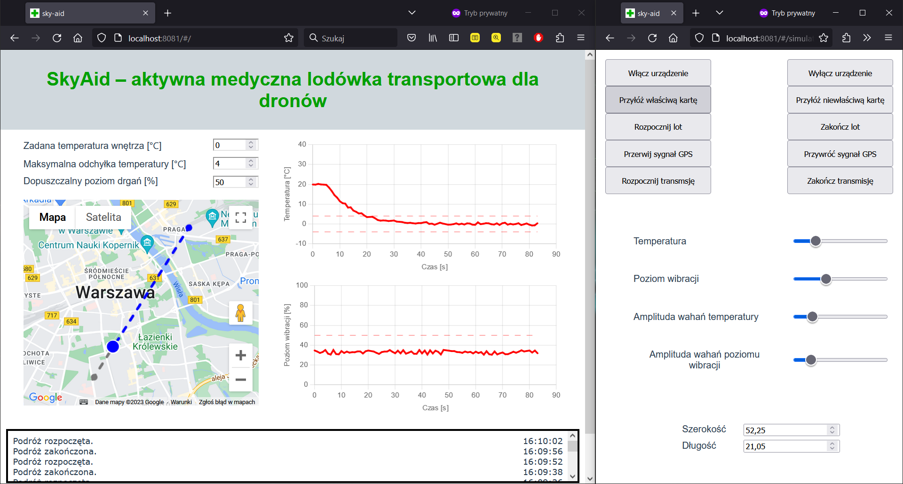

# sky-aid

Web application for monitoring and controlling the state of the refrigerator, utilized as container for medical transport via drone.
The app was made as a part of the project for completion of a subject during studies.

This software together with the device is intended to be used only in emergency cases by the professional drone controllers so the visual atractiveness of the interface was not the priority. Additionally, the simulator of the fridge transport was implemented, but only for manual test purposes as a mock for the real device. Due to not building the entire device, the on-board software design was also not it the scope of the project.

## Used technologies

- Vue 3
- TypeScript
- JavaScript (previously)
- HTML
- CSS
- Google Maps API

## Presentation

The views of the application (on left) and simulator (on right) are shown below.



## Requirements

- Node
- npm (or equivalent)
- Vue 3
- json-server
- access to google maps API

## Configuration

```bash
npm install
```

Setting up environmental variables in `.env.local` file.

```.env
VUE_APP_GOOGLE_MAP_API_KEY="<your api key>"
VUE_APP_SERVER_ADDRESS="<your server address>"
```

## Run in development mode

```bash
json-server --watch ./data/db.json
npm run serve
```

Open your browser with two different cards: *`VUE_APP_SERVER_ADDRESS`* and *`VUE_APP_SERVER_ADDRESS`*/simulator.

## For potential further development

- Split up the client and the simulator into different Vue projects
- Change json-server to a self implemented server which can save the journey data in database and probably have other usefull features
- Make the visualizal layer prettier, despite it is not intended for individual users
- Implement the software for the Raspberry Pi microcontroller appoited to be the board computer of the device and hence the source of the received data
